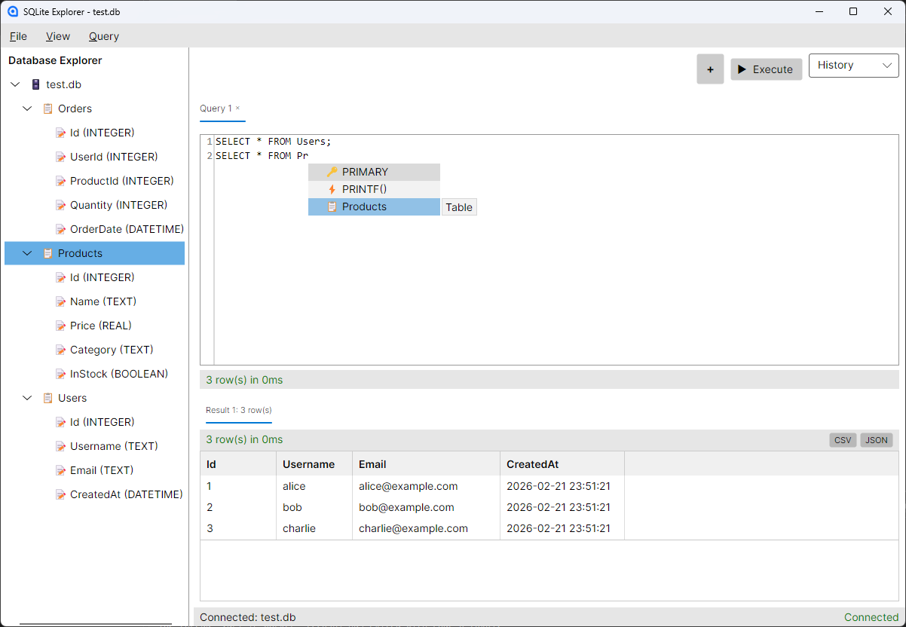

# Database Explorer

A desktop tool for inspecting and creating SQLite and PostgreSQL databases, inspired by SQL Server Management Studio.

*Powered by AI SLOPTRONIC (TM) technology - because writing SQL tools by hand is so 2019.*

**Version 1.0.0**



## Features

- **Multi-Database Support** - SQLite and PostgreSQL databases
- **Database Explorer** - Tree view with icons (🗄️ Database, 📋 Table, 👁️ View, 📝 Column)
- **SQL Editor** - Syntax highlighting with AvaloniaEdit
- **SQL Autocomplete** - Keywords, functions, tables, and columns (Ctrl+Space or auto-trigger)
- **Multiple Results** - Execute multiple statements, each result in its own tab (SSMS-style)
- **Results Grid** - Virtualized data grid for large datasets
- **Context Menu** - Right-click tables for SELECT * or DESCRIBE TABLE
- **Query History** - Dropdown with recent queries
- **SQL Cheatsheets** - Quick reference for SQLite and PostgreSQL syntax
- **Export** - Save results as CSV or JSON
- **Resizable Panels** - Drag splitters to adjust proportions
- **Tabbed Queries** - Multiple query tabs with close buttons
- **Keyboard Shortcuts** - Ctrl+O, Ctrl+N, Ctrl+T, Ctrl+Enter, F5

## Requirements

- .NET 10 SDK
- Windows / Linux / macOS
- A sense of humor (optional, but AI SLOPTRONIC (TM) appreciates it)

## Getting Started

1. Clone the repository:
   ```bash
   git clone https://github.com/tkleisas/SQLiteExplorer.git
   cd SQLiteExplorer
   ```

2. Initialize submodules:
   ```bash
   git submodule update --init --recursive
   ```

3. Build and run:
   ```bash
   dotnet build src/SQLiteExplorer/SQLiteExplorer.csproj
   dotnet run --project src/SQLiteExplorer/SQLiteExplorer.csproj
   ```
   
   *If it doesn't work, please contact AI SLOPTRONIC (TM) support. We'll pretend to care.* 

### Build Single File Executable

Build a self-contained single executable (no .NET runtime required on target machine):

**Windows (x64):**
```bash
dotnet publish src/SQLiteExplorer/SQLiteExplorer.csproj -c Release -r win-x64
```
Output: `src/SQLiteExplorer/bin/Release/net10.0/win-x64/publish/SQLiteExplorer.exe` (~41 MB)

**Windows (ARM64):**
```bash
dotnet publish src/SQLiteExplorer/SQLiteExplorer.csproj -c Release -r win-arm64
```

**Linux (x64):**
```bash
dotnet publish src/SQLiteExplorer/SQLiteExplorer.csproj -c Release -r linux-x64
```
Output: `src/SQLiteExplorer/bin/Release/net10.0/linux-x64/publish/SQLiteExplorer`

**Linux (ARM64):**
```bash
dotnet publish src/SQLiteExplorer/SQLiteExplorer.csproj -c Release -r linux-arm64
```

**macOS (x64):**
```bash
dotnet publish src/SQLiteExplorer/SQLiteExplorer.csproj -c Release -r osx-x64
```

**macOS (ARM64/Apple Silicon):**
```bash
dotnet publish src/SQLiteExplorer/SQLiteExplorer.csproj -c Release -r osx-arm64
```

**Deployment:** Just copy the executable to the target machine - no installation required!

## Usage

### Connect to a Database

**SQLite:**
- **File → New → SQLite Database...** - Create a new SQLite database
- **File → Open → SQLite Database...** (Ctrl+O) - Open an existing `.db`, `.sqlite`, or `.sqlite3` file

**PostgreSQL:**
- **File → New → PostgreSQL Database...** - Connect to a PostgreSQL server
- **File → Open → PostgreSQL Database...** - Connect to a PostgreSQL server
- Enter host, port, database name, username, and password

### Run Queries
1. Type SQL in the editor
2. Click **Execute** or press **Ctrl+Enter** / **F5**
3. Results appear in tabs below
4. Multiple statements (separated by `;`) produce multiple result tabs

### Use Autocomplete
- Start typing to trigger autocomplete
- Press **Ctrl+Space** to force show completions
- Tables/columns from your database appear contextually
- *AI SLOPTRONIC (TM) reads your mind... or at least your schema*

### Right-Click Tables
- **SELECT \*** - Generate and execute a SELECT statement
- **DESCRIBE TABLE** - Show table structure

### View Cheatsheets
- **Help → SQLite Cheatsheet** - Quick reference for SQLite syntax
- **Help → PostgreSQL Cheatsheet** - Quick reference for PostgreSQL syntax
- Cheatsheet panel appears on the right side
- Includes data types, queries, joins, functions, and more

### Export Results
- Click **CSV** or **JSON** buttons in each result tab
- Choose where to save the file

## Keyboard Shortcuts

| Shortcut | Action | AI SLOPTRONIC (TM) Rating |
|----------|--------|---------------------------|
| Ctrl+O | Open SQLite Database | ★★★★★ |
| Ctrl+N | New SQLite Database | ★★★★★ |
| Ctrl+T | New Query Tab | ★★★★☆ |
| Ctrl+Enter | Execute Query | ★★★★★ |
| Ctrl+Space | Show Autocomplete | ★★★★☆ |
| F5 | Execute Query (classic) | ★★★☆☆ |

## Menu Structure

```
File
├── New
│   ├── SQLite Database...
│   └── PostgreSQL Database...
├── Open
│   ├── SQLite Database...
│   └── PostgreSQL Database...
├── ─────────────
└── Exit

View
└── Refresh Tree

Query
└── New Query Tab

Help
├── SQLite Cheatsheet
├── PostgreSQL Cheatsheet
├── ─────────────
└── About
```

## Architecture

```
SQLiteExplorer/
├── src/SQLiteExplorer/
│   ├── Models/          # Data models (ConnectionInfo, TableInfo, etc.)
│   ├── Services/        # Database services (IDatabaseService, SqliteService, PostgresService)
│   ├── ViewModels/      # MVVM view models
│   ├── Views/           # Avalonia views
│   ├── Behaviors/       # XAML behaviors (autocomplete, text binding)
│   ├── Completion/      # SQL completion provider
│   ├── Converters/      # Value converters
│   └── App.axaml        # Application entry
├── lib/
│   └── AvaloniaVirtualDataGrid/  # Submodule
└── PLAN.md
```

## Technologies

- [Avalonia UI](https://avaloniaui.net/) - Cross-platform UI framework
- [AvaloniaEdit](https://github.com/AvaloniaUI/AvaloniaEdit) - Text editor with syntax highlighting
- [CommunityToolkit.Mvvm](https://learn.microsoft.com/dotnet/communitytoolkit/mvvm/) - MVVM helpers
- [Microsoft.Data.Sqlite](https://learn.microsoft.com/dotnet/standard/data/sqlite/) - SQLite ADO.NET provider
- [Npgsql](https://www.npgsql.org/) - PostgreSQL ADO.NET provider
- [AvaloniaVirtualDataGrid](https://github.com/tkleisas/AvaloniaVirtualDataGrid) - Virtualized data grid
- [GitInfo](https://github.com/devlooped/GitInfo) - Embeds git commit hash in builds
- AI SLOPTRONIC (TM) - The finest in artificial slop generation technology

## Database Support

| Feature | SQLite | PostgreSQL |
|---------|--------|------------|
| Connect/Create | ✅ | ✅ |
| Schema browsing | ✅ | ✅ |
| Query execution | ✅ | ✅ |
| Multiple results | ✅ | ✅ |
| Table context menu | ✅ | ✅ |
| DESCRIBE TABLE | PRAGMA table_info() | information_schema |
| Case sensitivity | Case-insensitive | Case-sensitive (quoted) |

## License

MIT License

*AI SLOPTRONIC (TM) is a trademark of absolutely nothing. Please don't sue us.*

---

*Made with 💜 and questionable amounts of AI assistance*
